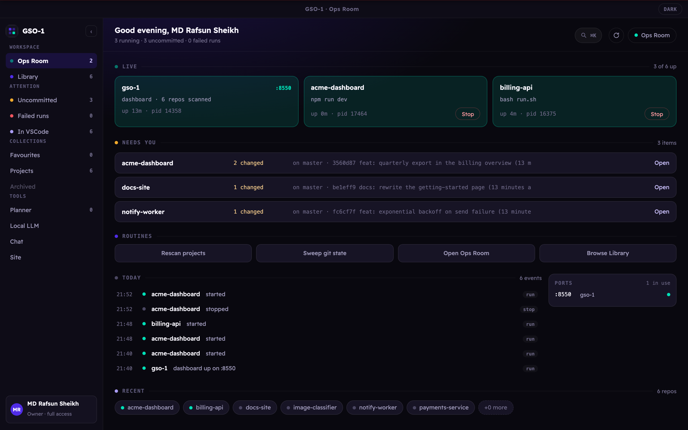
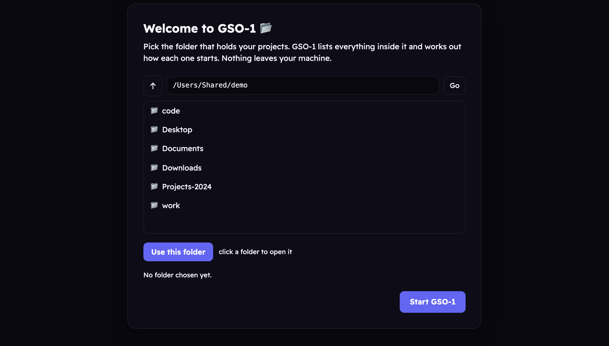
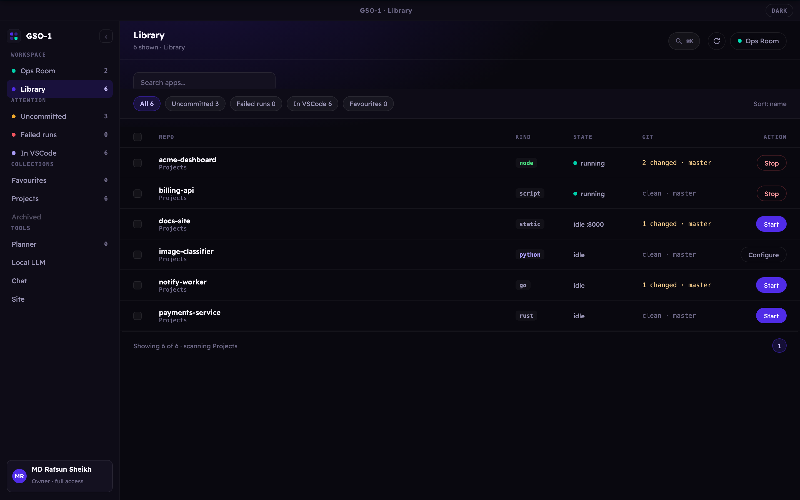
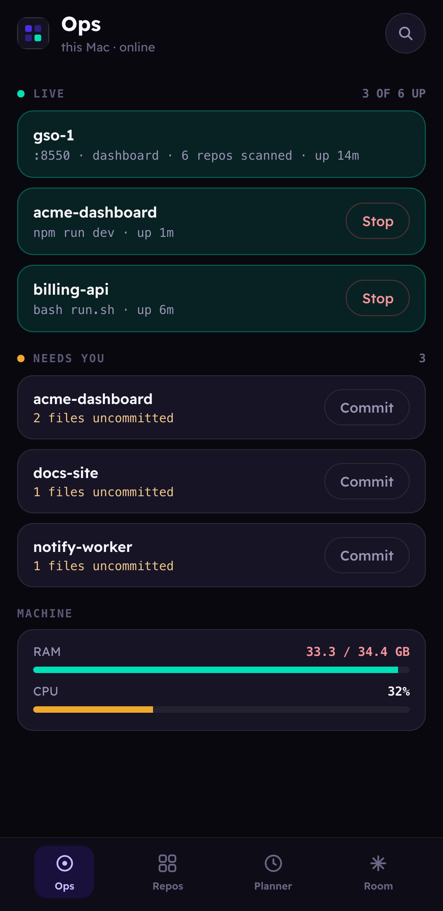

<h1 align="center">GSO-1 🗂️</h1>

<p align="center">
  <strong>The staff officer for your machine.</strong><br>
  <sub>Every project you own, running, healthy, and one click from started.</sub>
</p>

<p align="center">
  <a href="#why-it-is-called-gso-1">The idea</a> ·
  <a href="https://rafsunsheikh116.medium.com/your-computer-is-a-garrison-it-needs-a-staff-officer-ba23ab762140">Article</a> ·
  <a href="#the-ops-room">Ops Room</a> ·
  <a href="#quick-start">Quick start</a> ·
  <a href="#what-it-does">Features</a> ·
  <a href="RUNBOOK.md">Runbook</a> ·
  <a href="CONTRIBUTING.md">Contributing</a> ·
  <a href="SECURITY.md">Security</a> ·
  <a href="CHANGELOG.md">Changelog</a> ·
  <a href="LICENSE">Apache 2.0</a>
</p>

<p align="center">
  <a href="https://github.com/rafsunsheikh/gso-1/releases/latest"></a>
  <a href="https://github.com/rafsunsheikh/gso-1/releases"></a>
  <a href="LICENSE"></a>
  
  
  
</p>

<p align="center">
  
</p>

<p align="center">
  <sub><em>The Ops Room. Everything that needs you, on one screen.</em></sub>
</p>

---

## Why it is called GSO-1

In a division headquarters there is an officer called the **GSO-1**, General
Staff Officer Grade 1, a Lieutenant Colonel who heads the General Staff branch.
He is the right hand of the **GOC**, the General Officer Commanding the
division. He plans the operations, keeps the picture current, and drafts the
orders the GOC signs. In peace and in war, the division runs through him.

He works from the **Ops Room**, the nerve centre where the maps, the traces,
the unit locations, the strengths and the intelligence are all displayed and
kept up to date. It is where the commander is briefed, and where decisions get
made, because it is the one place the whole situation can actually be seen.

**Your computer is your garrison, and you are its GOC.**

You should not have to remember which of thirty services is running, which
branch each repo is on, or what command starts the one you touched last March.
That is staff work. GSO-1 does the staff work, and the Ops Room is where you
come to see everything and decide.

The old British staff manuals are unusually clear about what makes a good
one, and it turns out to be a decent product specification:

> **Serve the commander wisely and well.** Point it at your machine and it
> works out how everything runs, so you never type `npm run dev` from memory
> again.
>
> **Stay invisible; the commander gets the credit.** GSO-1 has no opinions
> about how you build software. It starts what you already built, and stays
> out of the way.
>
> **Shield the commander from unnecessary detail, reserving him for the real
> decisions.** Thirty repos, and the dashboard leads with the four that need
> you: the dirty ones, the stale ones, the one that crashed.
>
> **Never be a "yes man".** A staff officer who only ever reports good news is
> worse than none. So GSO-1 shows you the crashed process, the failed run, and
> the port conflict, plainly, in red, on the first screen.

Everything else in this README is detail. That is the idea.

> 📄 **The long version:** [Your Computer Is a Garrison. It Needs a Staff Officer.](https://rafsunsheikh116.medium.com/your-computer-is-a-garrison-it-needs-a-staff-officer-ba23ab762140)
> The naming, the staff doctrine behind the design decisions, and what it took to
> turn a tool that ran on exactly one machine into installers for three platforms.

---

## What is this, really?

You have thirty-odd folders in `~/Projects`. Four of them are running right now
and you are not completely sure which four. Two are on a stale branch. One is
holding port 3000 hostage. Starting any of them means remembering whether it was
`npm run dev`, `./run.sh`, `uvicorn app:app --reload`, or that one `make serve`
you wrote in 2023.

GSO-1 is the window that answers all of it.

Point it at a folder, **your** folder, on **your** machine: and it walks every
project inside, works out how each one starts, and gives you a row per app with
a start button, a live health light, and the git state. Nothing is uploaded.
Nothing runs in the cloud. It binds to `127.0.0.1` and talks to your filesystem
and your processes, because that is the entire point.

It is a control plane for the machine you already own.

---

## Stuff you do in GSO-1

- **Start anything without remembering how.** GSO-1 detects the run command for
  Node, Django, FastAPI, Flask, Streamlit, Rust, Go, static sites, and plain
  Python: and always defers to the project's own `run.sh` or `Makefile` when
  one exists.
- **See what is actually up.** Each app gets a real health state, healthy,
  starting, crashed, stopped, from process tracking plus a port probe, not from
  hope.
- **Find the thing eating your port** before you launch, instead of after the
  stack trace.
- **Check the git state of thirty repos at a glance**, branch, dirty count,
  ahead/behind, last commit: and `git pull --ff-only` the stale ones from the
  dashboard.
- **Hand a project to an agent with a seatbelt on.** Read-only tools run
  themselves; anything that writes a file or runs a command stops for an
  explicit ✅ Allow / ❌ Deny.
- **Run the agent on your own hardware.** A built-in Anthropic→llama proxy
  points a Claude session at your local `llama-server`, so the whole session
  stays on your GPU.
- **Check on it from your phone.** A companion UI at `/m`, refused outright
  unless you have deliberately set a token.

---

## A look inside

<table>
  <tr>
    <td width="50%" valign="top">
      <br>
      <sub><strong>One question on first run.</strong> Point it at your projects folder. No config file, no terminal, and nothing leaves the machine.</sub>
    </td>
    <td width="50%" valign="top">
      <br>
      <sub><strong>Six projects, six stacks, one start button each.</strong> node, script, static, python, go, rust. GSO-1 worked out the kind on its own.</sub>
    </td>
  </tr>
</table>

<table>
  <tr>
    <td width="34%" valign="top" align="center">
      
    </td>
    <td width="66%" valign="top">
      <br>
      <sub><strong>The companion at <code>/m</code>.</strong> The same Ops Room on a phone: what is live, what needs a commit, and how the machine is holding up. It refuses every request from outside the machine unless you have deliberately set a token, so opening it up is a decision you make rather than a default you inherit.</sub>
    </td>
  </tr>
</table>

---

## Quick start

### I just want to run it

Grab the installer for your platform from the
[latest release](https://github.com/rafsunsheikh/gso-1/releases/latest):

| Platform | File |
|---|---|
| macOS (Apple Silicon / Intel) | `GSO-1-<version>.dmg` |
| Windows | `GSO-1-Setup-<version>.exe` |
| Linux | `GSO-1-<version>.AppImage` |

Open it, and on first run GSO-1 asks which folder holds your projects. Pick it.
That is the whole setup, no Python, no terminal, no config file.

<details>
<summary><strong>macOS: "Apple could not verify GSO-1 is free of malware"</strong></summary>

GSO-1 is signed ad-hoc rather than with a paid Apple Developer ID, so macOS
asks you to approve it once. On **macOS 15 and later this is the only route**:
right-click and Open no longer works, and the first dialog you see offers only
*Done* and *Move to Bin*. Neither of those is the answer.

1. Drag **GSO-1** into **Applications** first, then try to open it once.
   The dialog appears. Click **Done**.
2. Open **System Settings → Privacy & Security**.
3. Scroll to the **Security** section near the bottom. You will see:

   > **"GSO-1" was blocked to protect your Mac.**  &nbsp; **[Open Anyway]**

4. Click **Open Anyway**, authenticate with Touch ID or your password, then
   click **Open** in the confirmation.

That is Apple's sanctioned route and it only happens once. If the button is not
there, it has expired: try opening GSO-1 again to make it reappear.

<sub>If you would rather not use the GUI, `xattr -dr com.apple.quarantine
/Applications/GSO-1.app` removes the quarantine flag your browser attached.
Verify the download against `SHA256SUMS.txt` first.</sub>

</details>

### I want to run it from source

**Requirements:** Python 3.11+, git.

```bash
git clone https://github.com/rafsunsheikh/gso-1.git
cd gso-1
cp .env.example .env      # point MANAGER_PROJECTS_DIRS at your code
./run.sh
```

`run.sh` builds a virtualenv, installs dependencies, and opens the dashboard at
**<http://127.0.0.1:8420>**.

<details>
<summary>Manual setup, if you would rather do it yourself</summary>

```bash
python3 -m venv .venv
source .venv/bin/activate
pip install -r requirements.txt
python -m thecmanager
```

</details>

### I want the desktop shell

```bash
cd desktop && npm install && npm start
```

---

## What it does

| Feature | How |
|---|---|
| **List every app** | Scans every top-level directory across one or more project roots. |
| **Start / stop** | One click. Each app runs in its own process group; logs stream to `data/logs/<app>.log`. |
| **Status & health** | Tracks the process and probes the app's port, healthy, starting, crashed, stopped. |
| **Port conflicts** | Detected before launch, not after the crash. |
| **Git status** | Branch, dirty file count, ahead/behind, last commit, remote. |
| **Update** | `git pull --ff-only` from the dashboard. |
| **Description** | Pulled from the README's first paragraph or `package.json`. |
| **Auto-detect** | Guesses the run command for explicit `run.sh` / `Makefile`, Node, Django, Streamlit, FastAPI, Flask, plain Python, Rust, Go, and static sites. |
| **Run setup / install** | Runs the detected setup command (`install.sh`, `npm install`, `pip install`) as a tracked job with live log tailing. |
| **Multi-root** | Point it at several folders at once, `"Personal:~/Projects,Work:~/work"`, each gets its own tab. |
| **Scheduled jobs** | Recurring tasks with their own history. |
| **Kanban boards** | An activity monitor for what you are actually working on. |

### Configuration

**Everything is configurable from the app.** Open **Settings** in the sidebar:

| Tab | What you set there |
|---|---|
| **Project folders** | Which folders GSO-1 scans. Add or remove them without restarting. |
| **Telegram** | Bot token and allowed chat ids, with a **Send a test message** button so a wrong chat id fails on the screen where you typed it rather than silently later. |
| **Local LLM** | Where `llama-server` is, which folders hold your models, and the endpoint the Ops Room agent talks to. |
| **Phone access** | The token required for any access from another device, and the bind address. |
| **Other** | Jekyll checkout for the Site tab, Tavily key for agent web search. |

Settings are written to `settings.json` in GSO-1's data folder, `0600`, and take
effect after a restart, which the app offers as a button.

<details>
<summary>Precedence, and configuring from a terminal instead</summary>

A real environment variable always wins, then Settings, then `.env`. Settings
beats `.env` because it is the more recent explicit act. Anything exported in
your environment shows as read-only in the app rather than accepting an edit
that would never take effect.

Every variable is still documented in [`.env.example`](.env.example) if you
would rather script it. The one most people touch:

```bash
MANAGER_PROJECTS_DIRS="Personal:~/Projects,Work:~/work/repos"
```

</details>

---

## The Ops Room

The dashboard shows you the situation. The Ops Room is the part you can **ask**.

> **"Which repos have uncommitted changes?"** is a question the dashboard answers
> by making you look. The Ops Room answers it by looking for you, across every
> project root, and telling you which ones and how many files.

It runs on a model **you** host, has ten tools rather than general-purpose
freedom, and asks before it changes anything.

| Ring | What it means |
|---|---|
| **Sandbox root** | The only directory it may *write* to. Resolved from the install location; override with `OPSROOM_SANDBOX_ROOT`. |
| **Read roots** | What it may read and search: the sandbox plus your project folders. |
| **Immutable** | Never writable, even inside the sandbox: the supervisor, `var/`, the launcher. The supervisor is what rolls back a bad self-edit. |

Every path check resolves symlinks and `..` first, so `sandbox/../../etc/passwd`
fails closed. Anything that writes a file or runs a command stops for an explicit
Allow or Deny; read-only tools run without asking, because prompting you to
approve a `git status` would train you to approve everything.

Point it at a local model in two lines:

```bash
llama-server --model ~/models/your-model.gguf --port 8080 --ctx-size 65536 --jinja
# then, in .env:
OPSROOM_LLAMA_URL=http://127.0.0.1:8080/v1
```

```bash
./ops "which repos have uncommitted changes?"
```

📖 **[Full Ops Room documentation](https://rafsunsheikh.github.io/gso-1/ops-room.html)** —
every tool, the sandbox model, all configuration variables, and why it edits code
it is not running.

---

## Git and GitHub

**There is no GitHub account to connect, and that is deliberate.**

GSO-1 shells out to the `git` already installed on your machine, so it inherits
whatever credentials you already use. If `git pull` works in your terminal for a
repository, it works in GSO-1 for that repository. If it does not, GSO-1 will
report the same failure your terminal would.

That means:

- **SSH keys** already in your agent keep working, including passphrase-protected
  ones your agent has unlocked.
- **A credential helper** (macOS Keychain, `gh auth login`, Windows Credential
  Manager) keeps working.
- **Nothing new is stored.** GSO-1 holds no tokens, asks for no OAuth scopes, and
  has no account of its own to compromise.

The read-only parts, branch, dirty count, ahead/behind, last commit, need no
credentials at all. Only **Update** (`git pull --ff-only`) and pushing from the
site CMS reach the network, and those use your existing setup.

<details>
<summary>If a repository will not update</summary>

Check the same thing you would check anywhere else:

```bash
cd ~/Projects/the-repo && git pull --ff-only
```

Whatever that prints is what GSO-1 is seeing. The usual causes are an SSH key
the agent has not loaded, a repository cloned over HTTPS with no helper
configured, or local commits that make a fast-forward impossible.

</details>

---

## Working with agents

GSO-1 can drive a `claude` CLI session inside any project it manages, from the
dashboard or from your phone.

1. Pick a project and open a session. Choose **subscription** (your normal
   Claude account) or **local** (routes through GSO-1's built-in
   Anthropic→llama proxy at `/v1/messages`, so the session runs on your own
   `llama-server`, start it from the Local LLM tab first).
2. Send messages. Each becomes a turn; the agent works in that project's
   directory and streams its reply back.
3. When it wants to **edit a file or run a command**, you get **✅ Allow /
   ❌ Deny**. Read-only tools run automatically.
4. The conversation persists across messages. `/clear` starts fresh, `/context`
   shows token usage, `/end` closes the session.

Each session keeps one long-lived process alive, so follow-up turns reuse the
already-loaded context instead of paying to reload it every message.

> Requires the `claude` CLI installed and signed in. Permission requests route
> through a small MCP server (`claude_perm_mcp.py`) that calls back into GSO-1.
> Local tool-use reliability depends on the model, run `llama-server` with
> `--jinja` and a tool-capable model.

---

## Works today · Being wired up · Pending code

| ✅ Works today | 🚧 Being wired up | 💭 Strong opinions, pending code |
|---|---|---|
| Registry, start/stop, health, port conflicts | Packaged installers for macOS / Windows / Linux | Plugin API for custom detectors |
| Git status and fast-forward updates | First-run folder picker (replacing `.env`) | Remote fleet, one dashboard, several machines |
| Auto-detection across 10+ project types | Windows support beyond the Python server | Per-project resource limits |
| Multi-root scanning with per-root tabs | Automated test suite | |
| Claude bridge with Allow/Deny permissions | | |
| Local LLM proxy and model management | | |
| Supervisor: versioned releases, health gate, rollback | | |
| Electron desktop shell with tray | | |
| Phone companion at `/m` behind a token | | |
| Scheduled jobs and kanban boards | | |

---

## Security

GSO-1 starts processes and runs commands as you. That is the feature, and it is
also the threat model.

- It binds **loopback only** by default, unreachable from your network.
- Remote access is **refused outright** unless you set `MANAGER_MOBILE_TOKEN`.
- Agent writes and commands require an **explicit approval**.

**Do not set `MANAGER_HOST=0.0.0.0` without a strong token**, and prefer a
tunnel over an open port. Full detail: and how to report a vulnerability
privately, is in [SECURITY.md](SECURITY.md).

---

## Layout

| Path | What lives there |
|---|---|
| `thecmanager/` | The FastAPI app, the whole dashboard backend |
| `thecmanager/static/` | The single-page dashboard UI |
| `supervisor/` | Release snapshots, promotion, restart-safe parent process |
| `desktop/` | Electron shell, the window and the child lifecycle |
| `opsroom/` | The agent sidecar |
| `scripts/` | Host setup helpers (launchd, GPU limit, mobile) |

More detail in [CONTRIBUTING.md](CONTRIBUTING.md) and the
[RUNBOOK](RUNBOOK.md).

---

## Contributing

Bug reports, new project-type detectors, and doc fixes are all welcome, see
[CONTRIBUTING.md](CONTRIBUTING.md). If GSO-1 guessed the wrong run command for
your stack, that is the best possible first pull request.

This project ships a [Code of Conduct](CODE_OF_CONDUCT.md).

## License

[Apache 2.0](LICENSE), Copyright 2026 Md Rafsun Sheikh.
